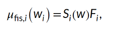
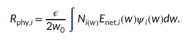
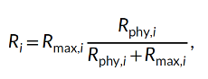
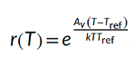
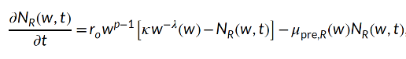

**Model name**

Baltic Sea Mizer

**Contacts**

Max Lindmark

**Spatial scale forcing**

Regional Scale, stock level. Not spatially explicit (ICES subdivions 25--29 and 32)

**Levels of gear disaggregation**

Bottom trawl. The model was calibrated to average values of F by species for the years 1992--2002, but was then fed with annual values of F for further analysis

**Levels of functional group disaggregation**

The Baltic Sea mizer model only has 3 fish species (cod and the two pelagic species sprat and herring. We used species-specific fishing efforts. We also have a plankton and a benthic resource spectrum.

**Spatial grid-cell allocation method**

The model is not spatially explicit, and we simply used total SSB for the stocks and their F values for calibration. 

**Fishing mortality rate equation**

We assume a knife edge fishing mortality starting at the size of maturation, which largely reflects the current situation. It is simply entered in the model as a size-based mortality. Total mortality is the sum of the background, starvation, fishing and predation mortality. The equation for the fishing mortality is:

{fig-align="center"}

where Si is the selectivity.

**Selectivity (size,age,species)**

See above.

**Model calibration**

Catchability is not included in the model. The model was calibrated to SSB from stock assessments (averaged between years 1992--2002). We treated Rmax as a free parameter and estimated it by finding the vector of species-specific Rmax that minimized the difference between predicted and observed SSB. This is a parameter that includes a density-dependent recruitment. The total potential recruitment is given by size and allocation to reproduction:

{fig-align="center"}

The actual recruitment follows a Beverton-Holt stock recruit relationship for, with a species-specific maximum recruitment (Rmax,i):

{fig-align="center"}

where Rmax,i is treated as a free parameter and is estimated in the calibration process by minimizing the residual sum of squares between spawning stock biomass from stock assessments and the MSSM. 

Projections from 1992 and 2012 also generally tracked the assessment SSBs correlation coefficients of 0.65, 0.94 and 0.54 for cod, herring, and sprat, respectively). Growth curves emerging from the model were in close agreement with von Bertalanffy curves fitted to length-at-age data from scientific trawl surveys, after a stepwise manual increase of the constant in the allometric maximum-consumption rate. We also found that emerging diets in the size-spectrum model were in line with observed diets. The level of density dependence imposed by the stock-recruitment function was also evaluated by assessing the ratio of the physiological recruitment, Rphy,i, to the recruitment Ri. These final values mean that stock recruitment is sensitive to the stock biomass, but there is some density dependence limiting recruitment (i.e., not all spawn produced become recruits). The fishing mortality leading to the highest long-term yield (FMSY) from the model (estimated for one species at the time while keeping each species at their mean assessment FMSY) agreed with the assessment FMSY for sprat and herring. For cod, FMSY is lower in the size-spectrum model than in stock assessments.

**Catchability and Creep (yearly rate of change catchability) Estimates**

We do not model catchability and instead just use estimated fishing mortalities from stock assessments.

**Further details on calibration**

No, we calibrated to SSB using Rmax, but used FMSY, level of density dependence, growth (size-at-age) and diets to ensure the model was capturing main features (though without any quantitative criteria).

**Statistical metrics**

We used the \"L-BFGS- B\" algorithm in the \'R\'-optimization function \'optim\' to minimize the residual sum of squares between the natural log of spawning stock biomass estimated in stock assessment output and those emergent in the model for the years 1992--2002. 

**Statistical results (summary)**

See above.

**Model changes or improvements(s) made as a result of calibration**

NA

**ADDITIONAL DETAILS FOR REGIONAL MODELS ONLY:**

**Downscaling method**

We used stock-specific models and fishing mortalities, so no downscaling was needed. 

**The \"base\" year range of the regional model**

We used absolute fishing mortalities (but calibrated the model to average conditions over a 20-year period.

**Environmental and biogeochemical variables and equations**

Temperature is included in the model and the projections stem from the regional coupled model system RCA4-NEMO under the RCP 8.5 scenario. These relative temperature trends (relative to mean in 1970--1999) are scaled by adding a constant such that the average temperature in the calibration time period is Tref (10°C).

We scale rates of individual metabolism, maximum consumption, search volume and background mortality with temperature. Metabolism and consumption are key terms in the energy budget of fish. Thus, the growth rate is not temperature-dependent directly but its relationship to temperature emerges from the temperature-scaling of metabolism and consumption. In mizer, metabolism represents all metabolic costs, that is, standard, activity, and movement. We assume metabolism in Mizer scales as standard metabolic rate and refer to it as metabolism or metabolic rate. We use the Arrhenius equation to scale rates relative to their reference value (at 10°C).

{fig-align="center"}

The rate-specific temperature sensitives are informed meta-analysis if interspecific experimental data.

Background resources are also temperature dependent. However, instead of forcing the spectra to observed abundance-at-size, we introduce the Arrhenius equation to the resource spectra\'s regeneration rate and carrying capacity. Their dynamics are given by the equation: 

{fig-align="center"}

where rowp−1 is the population regeneration rate, w- is the carrying capacity of the background resource.
